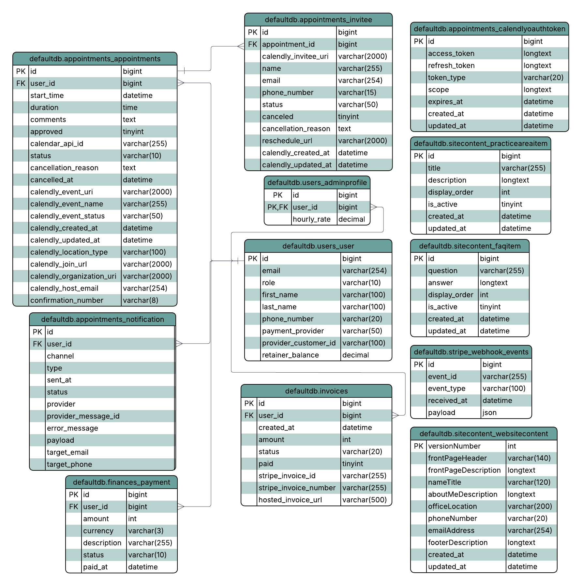

```
                 __          ____  _          _ _   ____            _       _   
      .,-;-;-,. /'_\        / ___|| |__   ___| | | / ___|  ___ _ __(_)_ __ | |_ 
    _/_/_/_|_\_\) /         \___ \| '_ \ / _ \ | | \___ \ / __| '__| | '_ \| __|
  '-<_><_><_><_>=/\          ___) | | | |  __/ | |  ___) | (__| |  | | |_) | |_ 
    `/_/====/_/-'\_\        |____/|_| |_|\___|_|_| |____/ \___|_|  |_| .__/ \__|
     ""     ""    ""                                                 |_|        

```

# Lydias-Law-Site

## 🧭 Project Overview

Lydia’s Law Site is a full-stack web application built for adoption attorney Lydia A. Suprun to modernize her practice and make her services more accessible to clients. Designed and developed by Shell Script, a senior project team from California State University, Sacramento, the site enables clients to schedule appointments, make secure payments, and learn more about Lydia’s work.

The project bridges real-world business needs with modern web development practices using Django, MySQL, and Bootstrap to deliver a reliable, responsive, and user-friendly experience. Built with future maintainability in mind, the platform allows Lydia to easily manage her content and continue growing her practice well beyond the completion of this project.

## Getting Started 🚀

### 🛠️ Prerequisites 
- Python 3.8 or higher installed
- A configured database (or access credentials ready)
- Google, Calendly, and Stripe API keys prepared for your .env file

## ⚙️ Configuration

### 1. Create and activate virtual environment

#### MacOS / Linux
```
$ python3 -m venv venv/
$ source venv/bin/activate
```
#### Microsoft
```
PS> py -m venv .venv\
PS> .venv\Scripts\activate
```

### 2. Install necessary python packages (virtual environment should be activated before)
```
$ pip install -r requirements.txt
```
### 3. Setting Up .env File 🔐
#### MacOS / Linux
```
cp .env.example .env
```
#### Windows
```
copy .env.example .env
```
#### Configure the .env File
###### Open the newly created .env file and fill in all the required environment variables (e.g., DATABASE_URL, SECRET_KEY, email settings, API keys, etc)
###### ⚠️The application will not run properly without valid environment variables⚠️ 

### 4. Running the Django Server ▶️
#### Start the development Server once environment variables and dependencies are configured
```
python manage.py runserver
```

## Features

### 1. Overview
Lydia's Law Site gives clients information about Lydia A. Suprun and her practice areas as an adoption lawyer. Clients can schedule appointments with her and make payments through the site. Aditionally, admin has control of what information the site contains and is able to manage appointments and payments.

### 2. Appointment Scheduling
- Clients can schedule appointments through the Contact Page or through their dashboard once they log in 
- Admin can schedule appointments for clients through their dashboard once they log in
- Clients will automatically recieve an email confirmation and reminder with appointment information

### 3. Payment
- Clients without an account are able to make payments through the payment page after recieving an invoice number
- Clients with an account can automatically see how much they owe and make payments after they log in

### 4. Client Dashboard
Through their dashboards, clients can:
- Schedule, cancel, and view upcoming appointments
- Make payments and view past transactions

### 5. Admin Dashboard
Through their dashboard, admin can:
- Schedule, cancel, and view upcoming and past appointments
- View complete and uncomplete transaction
- View client list
- Make edits to the content of the site

## 🧱 Architecture Overview

<p align="center">
  
</p>

### Project Application (`Lydias_Law_Site`)
- Stores the main project configuration, including:
  - Global Django settings
  - Root URL routing
  - WSGI/ASGI setup

### Core Application (`core`)
- Contains most of the website’s foundational functionality, including:
  - All primary HTML templates
  - Main URL paths
  - Core view logic used across the site

### Additional Applications

#### 📅 Appointments (`appointments`)
- Handles all Calendly-related operations, including sending and receiving API data.
- Includes database models for:
  - Appointments
  - Invitees
  - Notifications

#### 💰 Finances (`finances`)
- Contains models for payments and invoices.
- Will integrate with Stripe for financial transactions and tracking.

#### 📝 Site Content (`sitecontent`)
- Powers the Home, About, and Contact pages.
- Contains models for storing dynamic site content.

#### 👤 Users (`users`)
- Manages all authentication and account processes, including:
  - Login and signup
  - Email verification
  - Secure user session handling
- Includes models for:
  - User profiles
  - Admin profiles

## 🧑‍💻 Tech Stack Overview
### Frontend:
- Mark-up/Styling: HTML/CSS
- Framework: [Bootstrap](https://getbootstrap.com/)
### Backend:
- Programming Language: [Python](https://www.python.org/)
- Framework: [Django](https://www.djangoproject.com/)
- Database: [MySQL](https://www.mysql.com/)

## 🔒 Security and Privacy
- Because the site handles user accounts, appoinments, and payments, it includes basic security measures to protect client data:
  - Passwords are hashed and never stored in plain text
  - Payment processing is handled through a secure third party provider, so no credit card information is stored on the site
  - Input validation and access controls help prevent unauthorized access

## Deployment (next semester)
- Stack
  - Cloud Provider: DigitalOcean
  - Web Server: Nginx
  - App Server: Gunicorn
  - Backend: Django
  - Database: Managed MySQL on DigitalOcean
  - CI/CD: GitHub Actions (self-hosted runner)
  - Security: HTTPS, firewall

- Deployment Process
  1. Developer pushes code to main branch
  2. GitHub Actions pipeline runs
  3. Changes are automaitcally deployed to the production server
  4. Website updates live
## Testing 
 Lydia's Law Site uses Django's built-in test framework. Tests are located in a `tests.py` file inside each Django app.

### Running All Tests
 Make sure your virtual environment is activated and your `.env` file is configured, then run:
```bash
 python manage.py test
```
### Running Tests for a Specific App

 - `python manage.py test appointments`
 - `python manage.py test finances`
 - `python manage.py test users`

You can also run a specific test class or method:

```bash
python manage.py test appointments.tests.AppointmentModelTests
python manage.py test appointments.tests.AppointmentModelTests.test_create_appointment
```

### Running with Verbose Output

```bash
python manage.py test -v 2
```

Verbosity levels: `0` (minimal), `1` (default), `2` (verbose), `3` (very verbose).

### Reading the Output

A passing run ends with: `OK`

A failing run will show `F` or `E` with a traceback indicating which test failed and why. Fix the issue and re-run until all tests pass.

### Before Pushing Code

Always run the full test suite before pushing your branch:
- `python manage.py test`
- Do not push if any tests are failing.
- If a test is failing due to an intentional change, update the test rather than skipping it.   

## Developer Instructions
 In order to make changes to the code base, setting up the environment is crucial. These instructions will assume the use of a Windows system.

### Installing Visual Studio Code
You can download Visual Studio Code and use it as your IDE by going to the site below and choosing the Windows option. 

```bash
https://code.visualstudio.com/Download
```
### Installing Python
Because this site uses Django, Python is required. It can be downloaded using the link below. The code base was created with Python version 3.8 or higer in mind. If any compatibility issues arise, version 3.8 is recomended.

```bash
https://www.python.org/downloads/
```
### Cloning the Repository
In Visual Studio Code, make sure you are signed in to your Github account both for 'Sign in to sync settings' and 'Sign in with Github to use Github Pull Requests.' 

You can then open a terminal and run the following command to clone the repository.
```bash
git clone https://github.com/CSUS-Shell-Script/Lydias-Law-Site.git
```

### Activating the Virtual Environment
Once the repository is cloned, you can create the virtual environment by running the following command using Visual Studio Code.
```Bash
python -m venv .venv
```
Once created, the virtual environment can be activated by running the following command.
```bash
.venv/Scripts/Activate.ps1
```
Once the activating script has been executed, you will need to use the Visual Studio Code command palette to selects a Python Interperter. Make sure to select the virtual environment we have just created.
```bash
>Python: Select Interperter
```
### Pip Install
With your virtual environment now activated, you will need to install the correct packages and Python modules for the project.

In a new terminal that has venv activated, execute the following command exactly as written: 
```
pip install -r requirements.txt
```
If your environment is configured properly, this should download all the required packages with the necessary versions from the corresponding “requirements.txt” file.

### Environment Variables
The last step to configure involves setting up your environment variables within the project. The “.env.example” file is within the repository to outline what variables are needed to run the project on your local machine. 

Create a new .env file within the repository directory. Be sure that that this new file is created directly under the project folder 'Lydias-Law-Site' that you have cloned. If correctly configured, it should become grey signifying that it is a hidden file and will not be kept in git pushes.

It is incredibly important that this file is greyed out and the information within is not shared with anyone else besides trusted developers. The information within the .env file will describe the secret tokens and api keys needed to access endpoints. 

One of the more important environment variables is the PATH_TO_CERT variable (not mentioned in ".env.example" file but is very important to have). This certification will be provided by a trusted developer along with the rest of the keys. Use a relative path such as: “./certification.crt” and set it to the PATH_TO_CERT vairable in the ".env" file for easy configuration of the PATH_TO_CERT environment variable.

Also note that the SECRET_KEY variable from ".env.example" is not used in the ".env" file.

### Confirming Your Environment
To confirm that your environment is working, open a terminal within VS Code and execute the following command: 
```
py manage.py runserver
````
If your environment is configured successfully, you should see the debug variable being set to 1 (from your ".env" file) which allows the project to run on localhost, the command executed in the terminal, as well as the local IP the local server is running on. You can click and open the local server link in your browser from the "Starting development server at http://..." part of your terminal to view the site on your localhost development enviornment. You can test your site through this development enviornment on your browser before deploying.

If you face any errors, ensure that your debug variable in your .env is 1 and you have the proper keys set up with the correct variable names. 


## Contributors 🐢
- [Hunter Powell](https://github.com/hunterpowell)
- [Michael Kenny](https://github.com/mlkenny)
- [Jason Prakash](https://github.com/jasoonkp)
- [Moises Robledo](https://github.com/moises9973)
- [Maria Adil](https://github.com/MADIL99)
- [Regina Gil](https://github.com/reggiee76)
- [Alex Giovannini](https://github.com/ARGiovannini)
- [Nayeli Flores Valdez](https://github.com/nayelifv)
